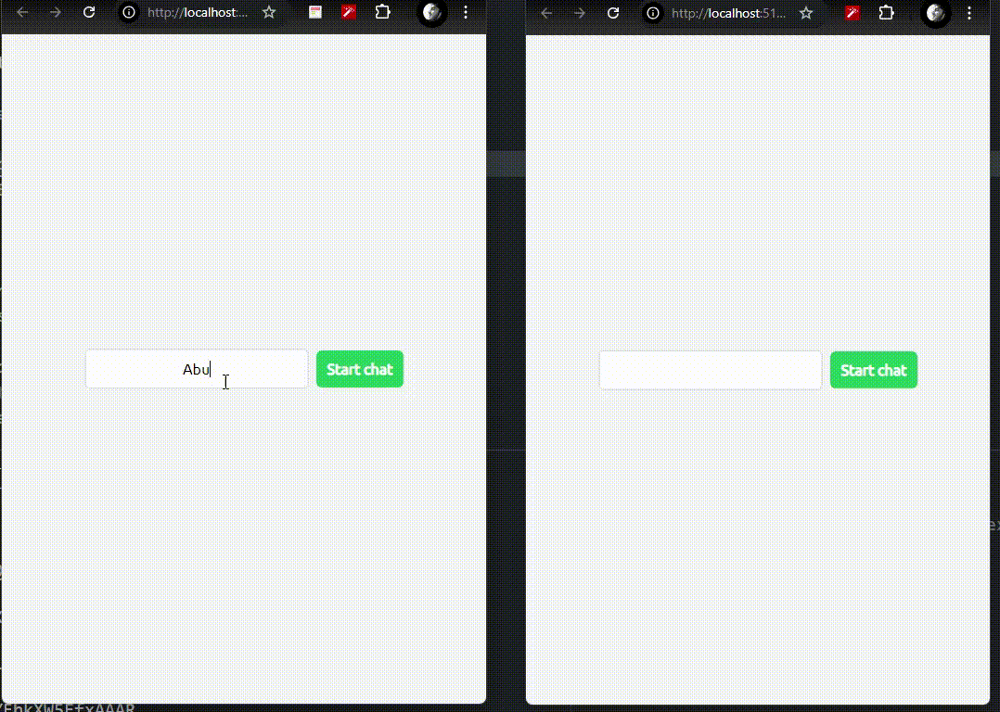

# ChatApp



This application allows users to communicate in real-time via a chat interface.

## Features

- Real-time messaging with Socket.IO
- User-friendly chat interface
- Fast development with Vite
- Scalable backend with Node.js and Express

## Technologies Used

- **Frontend:** React, Vite
- **Backend:** Node.js, Express
- **Real-Time Communication:** Socket.IO

## Getting Started

### Installation

1. **Clone the repository:**

   ```bash
   git clone https://github.com/yourusername/chatapp.git
   cd chatapp
   ```

2. **Navigate to the server directory and install dependencies:**

   ```bash
   cd server
   npm install
   ```

3. **Navigate to the client directory and install dependencies:**

   ```bash
   cd client
   npm install
   ```

###Running the Application

1. **Start the backend server:**

   ```bash
   cd server
   nodemon index.js
   ```

2. **Start the frontend development server:**

   ```bash
   cd client
   npm run dev
   ```

3. **Open your browser and navigate to:**

   ```bash
   http://localhost:5173/
   ```

## Usage

- Chat Interface: Users can send and receive messages in real-time.
- Real-Time Updates: Messages are instantly updated across all connected clients.
